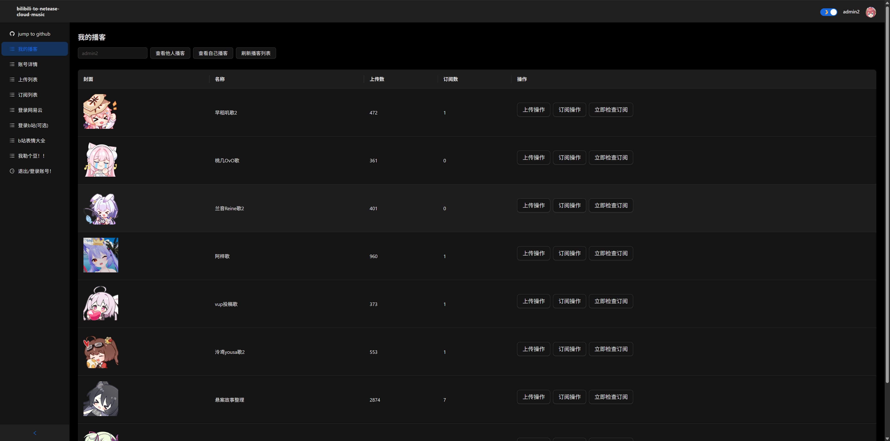
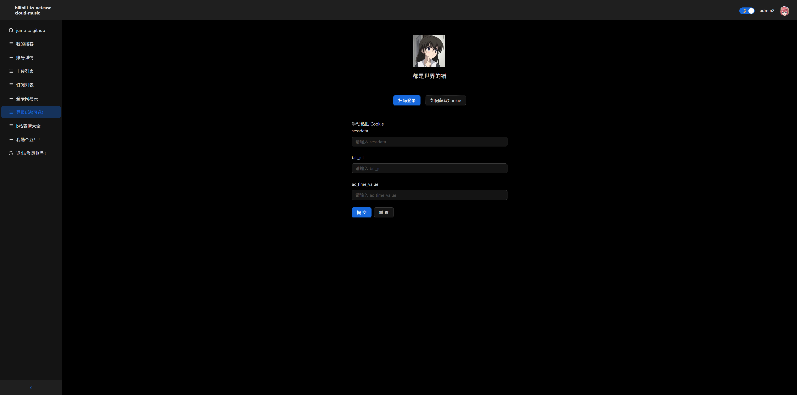
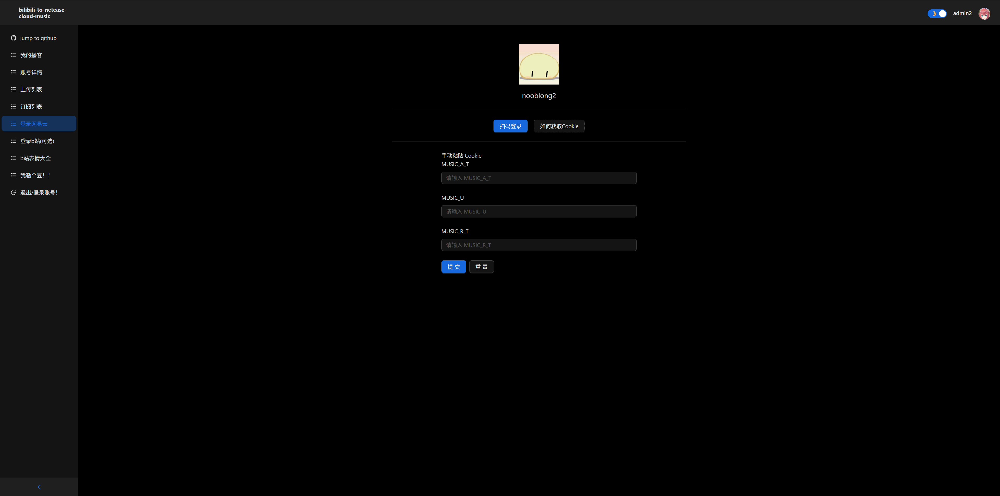
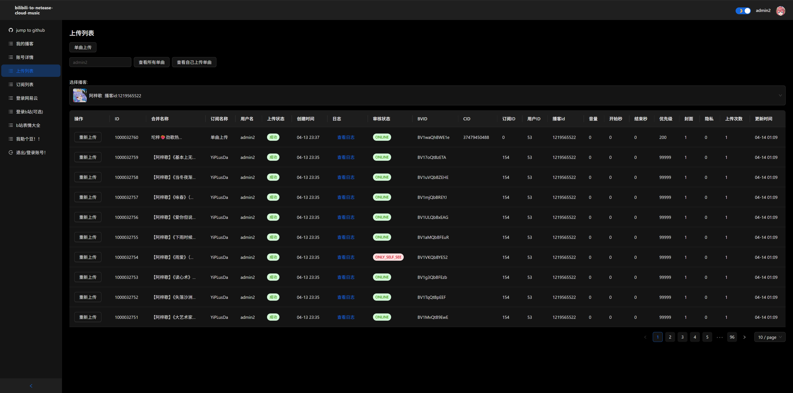
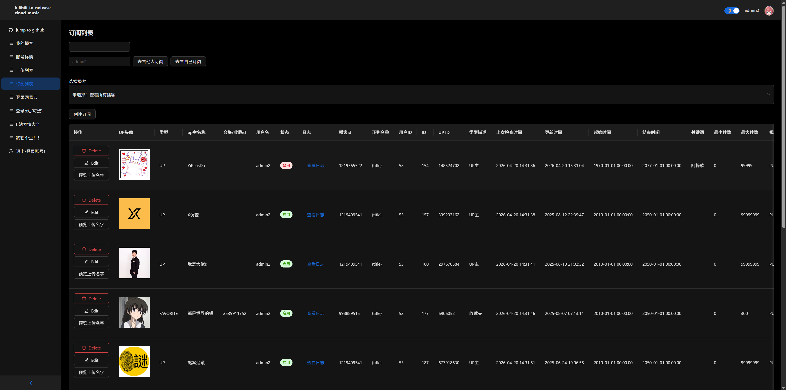
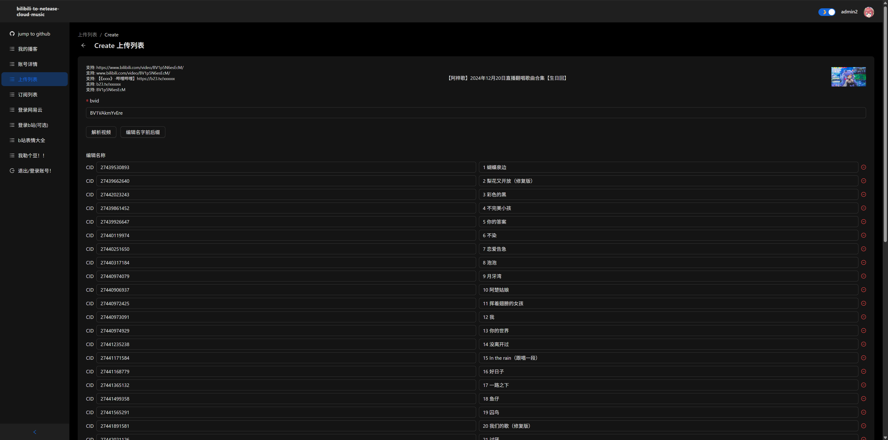
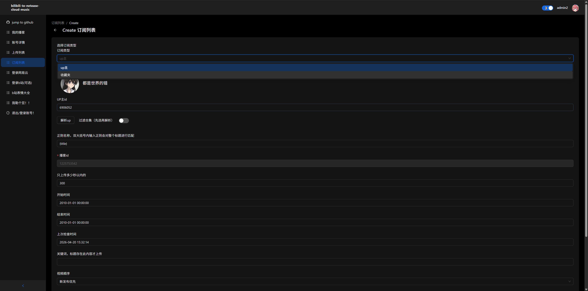
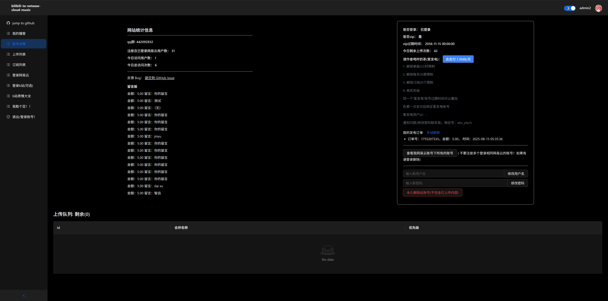

# b站视频一键转网易云播客后端

如何启动:

1. 启动bilibili-api
   1. 安装python3.14.4环境
   2. 克隆 https://github.com/nooblong/bilibili-api 的main分支
   3. 安装依赖 pip install -r requirements.txt
   4. 测试启动 python server.py, 成功后关闭
   5. 填写src/main/resources/application.yml里的pythonPath
2. 启动mysql并导入mysql结构netmusic.sql
3. 填写application.yml中的mysql配置
4. 启动前端
   1. 安装nodejs环境v24.15.0
   2. 克隆 https://github.com/nooblong/bilibili-to-netease-cloud-music-ui
   3. 安装依赖 npm install
   4. 启动 npm run dev

